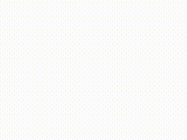

# Grid Paint

Grid Paint is a web-based drawing tool that allows you to create grid-style art. It uses the p5.js library for rendering and provides a simple interface for drawing and saving your creations.

## Getting Started

1. Clone the repository or download the source code.
2. Install Node.js if you haven't already.
3. Run the following command to serve the application:

```bash
npx serve
```

4. Open your browser and navigate to `http://localhost:3000` to start using Grid Paint.

## Features

- Draw grid-style art with adjustable grid size.
- Toggle between black and white brush colors.
- Save your drawings as PNG images.

## Demo

Here's a demo of Grid Paint in action:



You can also test the live version of Grid Paint [here](https://waqas25.netlify.app/paint-tools/gridpaint/).

## License

This project is open-source and available under the MIT License.
